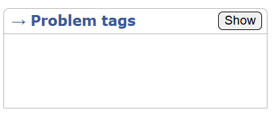

Web extension for Code Forces: Injects a button at the head of "Problem Tags" block to hide/unhide the problem tags.

It hides the problem tags by default, click the `show` button to see the problem tags.

This works for URLs in the format `https://codeforces.com/*/problem/*`.

Note:
- It considers the first div of the class `"roundbox sidebox borderTopRound"` that contains the text `"→ Problem tags"` in it's innerText.
- It changes the `position` of that div to `relative` and inserts a new button.
- To hide the tags, it sets the css property `visibility: hidden;` to the child-div that contains the tags.
